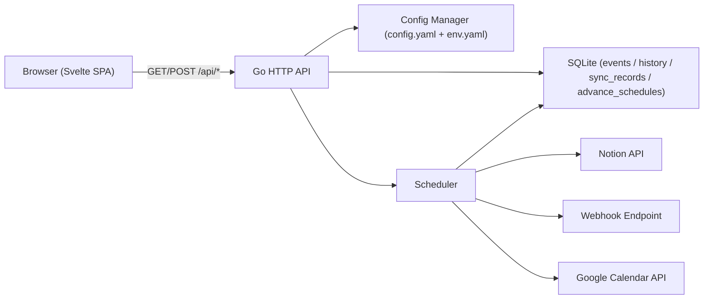
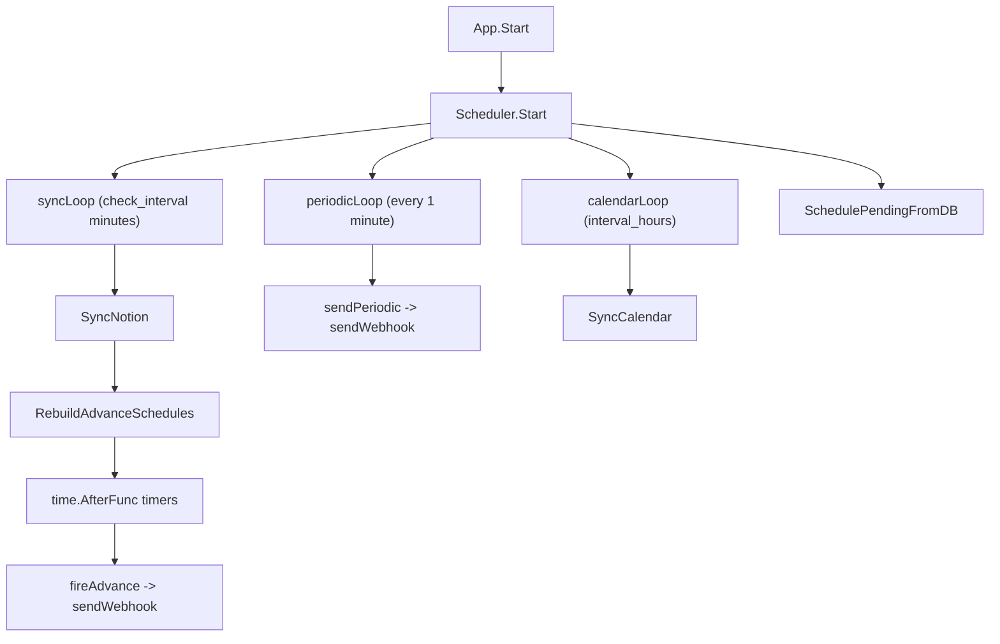
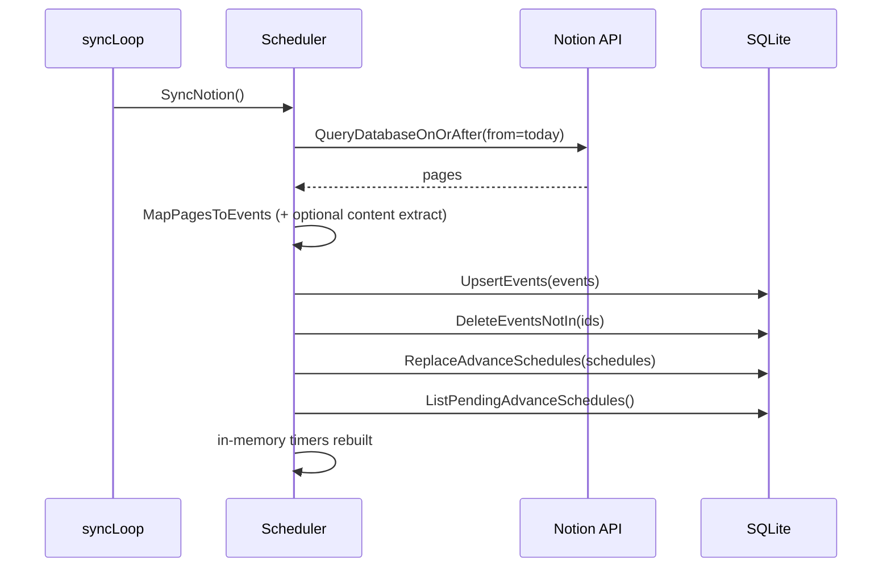
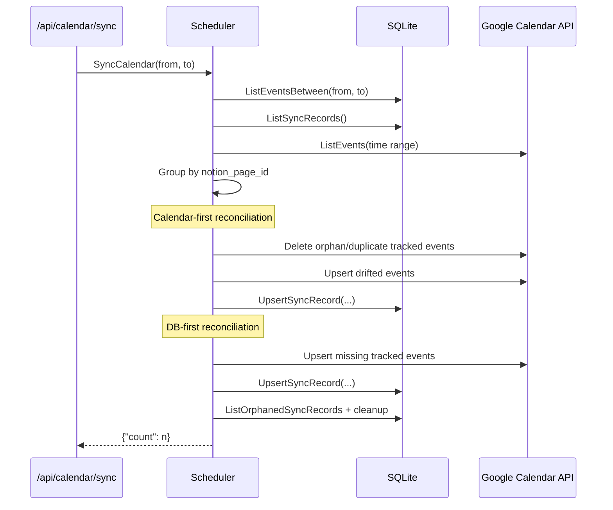

# Data Flow

## 1. System Context

```mermaid
flowchart LR
    Browser["Browser (Svelte SPA)"] -->|"GET/POST /api/*"| API["Go HTTP API"]
    API --> CFG["Config Manager (config.yaml + env.yaml)"]
    API --> DB["SQLite (events / history / sync_records / advance_schedules)"]
    API --> SCH["Scheduler"]

    SCH --> Notion["Notion API"]
    SCH --> Webhook["Webhook Endpoint"]
    SCH --> GCal["Google Calendar API"]
    SCH --> DB
```

## 2. Runtime Loops

```mermaid
flowchart TD
    Start["App.Start"] --> SchedulerStart["Scheduler.Start"]
    SchedulerStart --> SyncLoop["syncLoop (check_interval minutes)"]
    SchedulerStart --> PeriodicLoop["periodicLoop (every 1 minute)"]
    SchedulerStart --> CalendarLoop["calendarLoop (interval_hours)"]
    SchedulerStart --> RestoreTimers["SchedulePendingFromDB"]

    SyncLoop --> SyncNotion["SyncNotion"]
    SyncNotion --> RebuildAdvance["RebuildAdvanceSchedules"]
    RebuildAdvance --> TimerQueue["time.AfterFunc timers"]
    TimerQueue --> FireAdvance["fireAdvance -> sendWebhook"]

    PeriodicLoop --> SendPeriodic["sendPeriodic -> sendWebhook"]
    CalendarLoop --> SyncCalendar["SyncCalendar"]
```

## 3. Notion Sync Path

```mermaid
sequenceDiagram
    participant SL as syncLoop
    participant SC as Scheduler
    participant NO as Notion API
    participant DB as SQLite

    SL->>SC: SyncNotion()
    SC->>NO: QueryDatabaseOnOrAfter(from=today)
    NO-->>SC: pages
    SC->>SC: MapPagesToEvents (+ optional content extract)
    SC->>DB: UpsertEvents(events)
    SC->>DB: DeleteEventsNotIn(ids)
    SC->>DB: ReplaceAdvanceSchedules(schedules)
    SC->>DB: ListPendingAdvanceSchedules()
    SC->>SC: in-memory timers rebuilt
```

## 4. Calendar Sync Path (Notion is Source of Truth)

```mermaid
sequenceDiagram
    participant API as /api/calendar/sync
    participant SC as Scheduler
    participant DB as SQLite
    participant GC as Google Calendar API

    API->>SC: SyncCalendar(from, to)
    SC->>DB: ListEventsBetween(from, to)
    SC->>DB: ListSyncRecords()
    SC->>GC: ListEvents(time range)
    SC->>SC: Group by notion_page_id

    Note over SC: Calendar-first reconciliation
    SC->>GC: Delete orphan/duplicate tracked events
    SC->>GC: Upsert drifted events
    SC->>DB: UpsertSyncRecord(...)

    Note over SC: DB-first reconciliation
    SC->>GC: Upsert missing tracked events
    SC->>DB: UpsertSyncRecord(...)

    SC->>DB: ListOrphanedSyncRecords + cleanup
    SC-->>API: {"count": n}
```
