# Function-Level Detailed Graph (All Functions)

Generated: 2026-02-17 JST

## Coverage
- total functions: 248
- go functions (including tests): 202
- frontend functions (ts+svelte): 45
- script functions: 1
- edge rule: static same-group call references (cross-group links are shown in the integrated graph).

## Group Index
| Group | Functions | Edges |
|---|---:|---:|
| `fe:web/src/App.svelte` | 10 | 4 |
| `fe:web/src/components/PreviewModal.svelte` | 3 | 1 |
| `fe:web/src/components/TemplateGuideSidebar.svelte` | 1 | 0 |
| `fe:web/src/lib/api.ts` | 1 | 0 |
| `fe:web/src/lib/store.ts` | 4 | 1 |
| `fe:web/src/routes/Calendar.svelte` | 3 | 0 |
| `fe:web/src/routes/Dashboard.svelte` | 7 | 3 |
| `fe:web/src/routes/History.svelte` | 3 | 0 |
| `fe:web/src/routes/Notifications.svelte` | 10 | 1 |
| `fe:web/src/routes/Settings.svelte` | 3 | 0 |
| `go:api` | 30 | 50 |
| `go:app` | 6 | 5 |
| `go:calendar` | 15 | 8 |
| `go:config` | 26 | 22 |
| `go:db` | 30 | 13 |
| `go:logging` | 2 | 0 |
| `go:main` | 1 | 0 |
| `go:middleware` | 3 | 1 |
| `go:notion` | 22 | 18 |
| `go:retry` | 5 | 0 |
| `go:scheduler` | 54 | 32 |
| `go:static` | 1 | 0 |
| `go:template` | 5 | 4 |
| `go:webhook` | 2 | 1 |
| `script:scripts/deploy-mac.sh` | 1 | 1 |

## fe:web/src/App.svelte

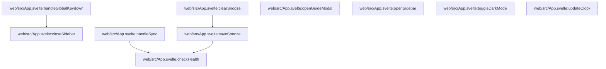

## fe:web/src/components/PreviewModal.svelte

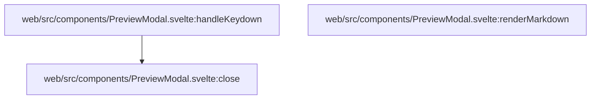

## fe:web/src/components/TemplateGuideSidebar.svelte

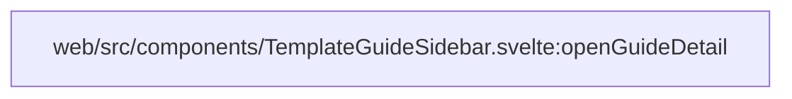

## fe:web/src/lib/api.ts

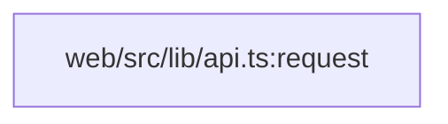

## fe:web/src/lib/store.ts

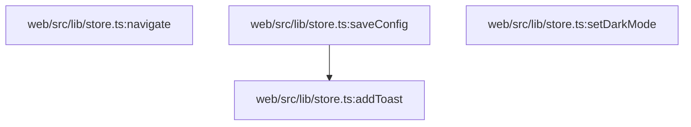

## fe:web/src/routes/Calendar.svelte

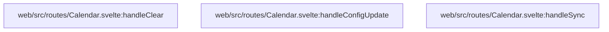

## fe:web/src/routes/Dashboard.svelte

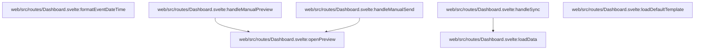

## fe:web/src/routes/History.svelte

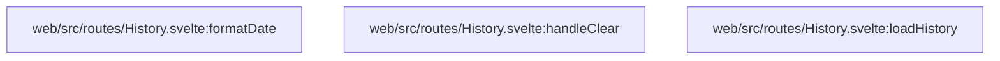

## fe:web/src/routes/Notifications.svelte

```mermaid
flowchart TD
  n1["web/src/routes/Notifications.svelte:addAdvanceRule"]
  n2["web/src/routes/Notifications.svelte:addPeriodicRule"]
  n3["web/src/routes/Notifications.svelte:openPreview"]
  n4["web/src/routes/Notifications.svelte:previewTemplate"]
  n5["web/src/routes/Notifications.svelte:removeAdvanceRule"]
  n6["web/src/routes/Notifications.svelte:removePeriodicRule"]
  n7["web/src/routes/Notifications.svelte:resetAdvanceTemplate"]
  n8["web/src/routes/Notifications.svelte:resetPeriodicTemplate"]
  n9["web/src/routes/Notifications.svelte:saveConfig"]
  n10["web/src/routes/Notifications.svelte:toggleDay"]
  n4 --> n3
```

## fe:web/src/routes/Settings.svelte

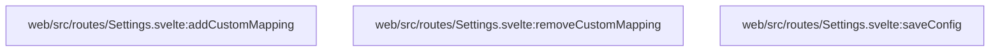

## go:api

```mermaid
flowchart TD
  n1["internal/http/api/handler.go:(Handler).Register"]
  n2["internal/http/api/handler.go:(Handler).getConfig"]
  n3["internal/http/api/handler.go:(Handler).handleCalendarClear"]
  n4["internal/http/api/handler.go:(Handler).handleCalendarSync"]
  n5["internal/http/api/handler.go:(Handler).handleConfig"]
  n6["internal/http/api/handler.go:(Handler).handleDashboard"]
  n7["internal/http/api/handler.go:(Handler).handleDefaultTemplates"]
  n8["internal/http/api/handler.go:(Handler).handleHistory"]
  n9["internal/http/api/handler.go:(Handler).handleHistoryClear"]
  n10["internal/http/api/handler.go:(Handler).handleManualNotification"]
  n11["internal/http/api/handler.go:(Handler).handlePreviewNotification"]
  n12["internal/http/api/handler.go:(Handler).handleSync"]
  n13["internal/http/api/handler.go:(Handler).handleUpcomingEvents"]
  n14["internal/http/api/handler.go:(Handler).putConfig"]
  n15["internal/http/api/handler.go:NewHandler"]
  n16["internal/http/api/handler_test.go:TestHandleDefaultTemplates"]
  n17["internal/http/api/handler_test.go:TestHandleManualNotificationPersistsTemplateBeforeSend"]
  n18["internal/http/api/handler_test.go:TestHandlePreviewNotificationReturnsMessageOnly"]
  n19["internal/http/api/handler_test.go:TestHandleUpcomingEventsCalendarState"]
  n20["internal/http/api/handler_test.go:fetchCalendarStates"]
  n21["internal/http/api/handler_test.go:postJSON"]
  n22["internal/http/api/handler_test.go:setupAPIHandler"]
  n23["internal/http/api/helpers.go:requireMethod"]
  n24["internal/http/api/helpers.go:respondError"]
  n25["internal/http/api/helpers.go:respondJSON"]
  n26["internal/http/api/helpers.go:respondValidationError"]
  n27["internal/http/api/timeutil.go:formatDurationShort"]
  n28["internal/http/api/timeutil.go:loadLocationOrLocal"]
  n29["internal/http/api/timeutil.go:parseDateInput"]
  n30["internal/http/api/timeutil.go:parseDateRange"]
  n2 --> n25
  n3 --> n23
  n3 --> n24
  n4 --> n23
  n4 --> n24
  n4 --> n25
  n4 --> n30
  n5 --> n24
  n6 --> n23
  n6 --> n24
  n6 --> n25
  n6 --> n27
  n6 --> n28
  n7 --> n23
  n7 --> n25
  n8 --> n23
  n8 --> n24
  n8 --> n25
  n9 --> n23
  n9 --> n24
  n10 --> n23
  n10 --> n24
  n10 --> n25
  n10 --> n30
  n11 --> n23
  n11 --> n24
  n11 --> n25
  n11 --> n30
  n12 --> n23
  n12 --> n24
  n12 --> n25
  n13 --> n23
  n13 --> n24
  n13 --> n25
  n13 --> n28
  n14 --> n24
  n14 --> n25
  n14 --> n26
  n16 --> n22
  n17 --> n22
  n18 --> n21
  n18 --> n22
  n19 --> n20
  n19 --> n22
  n22 --> n15
  n23 --> n24
  n24 --> n25
  n26 --> n25
  n30 --> n28
  n30 --> n29
```

## go:app

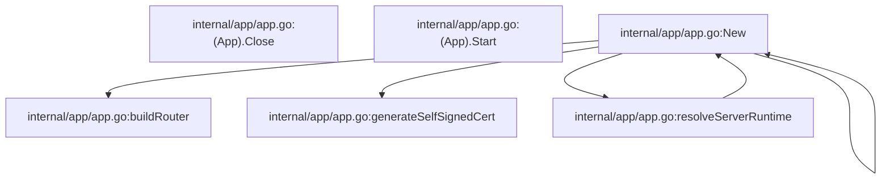

## go:calendar

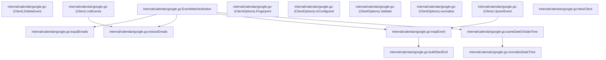

## go:config

```mermaid
flowchart TD
  n1["internal/config/config.go:ApplyEnvOverrides"]
  n2["internal/config/config.go:DefaultTemplates"]
  n3["internal/config/config.go:IsSnoozed"]
  n4["internal/config/config.go:LoadConfig"]
  n5["internal/config/config.go:LoadEnv"]
  n6["internal/config/config.go:NormalizeConfig"]
  n7["internal/config/config.go:SanitizeTemplate"]
  n8["internal/config/config.go:ValidateConfig"]
  n9["internal/config/config.go:WriteConfig"]
  n10["internal/config/config.go:pickEnv"]
  n11["internal/config/config.go:pickEnvBool"]
  n12["internal/config/config.go:pickEnvInt"]
  n13["internal/config/config.go:validateHHMM"]
  n14["internal/config/config_test.go:TestApplyEnvOverridesAppPort"]
  n15["internal/config/config_test.go:TestApplyEnvOverridesBasicAuthEnabled"]
  n16["internal/config/config_test.go:TestApplyEnvOverridesTLSFiles"]
  n17["internal/config/config_test.go:TestApplyEnvOverridesWebhookURLs"]
  n18["internal/config/config_test.go:TestDefaultTemplatesContainExpectedTokens"]
  n19["internal/config/manager.go:(Manager).Config"]
  n20["internal/config/manager.go:(Manager).Env"]
  n21["internal/config/manager.go:(Manager).Reload"]
  n22["internal/config/manager.go:(Manager).Snapshot"]
  n23["internal/config/manager.go:(Manager).UpdateConfig"]
  n24["internal/config/manager.go:(ValidationError).Error"]
  n25["internal/config/manager.go:(ValidationError).Unwrap"]
  n26["internal/config/manager.go:NewManager"]
  n1 --> n10
  n1 --> n11
  n1 --> n12
  n4 --> n6
  n4 --> n8
  n6 --> n7
  n8 --> n13
  n9 --> n6
  n14 --> n1
  n15 --> n1
  n16 --> n1
  n17 --> n1
  n18 --> n2
  n21 --> n1
  n21 --> n4
  n21 --> n5
  n23 --> n6
  n23 --> n8
  n23 --> n9
  n26 --> n1
  n26 --> n4
  n26 --> n5
```

## go:db

```mermaid
flowchart TD
  n1["internal/db/db.go:(Repository).ClearNotificationHistory"]
  n2["internal/db/db.go:(Repository).ClearSyncRecords"]
  n3["internal/db/db.go:(Repository).Close"]
  n4["internal/db/db.go:(Repository).DeleteEventsNotIn"]
  n5["internal/db/db.go:(Repository).DeleteSyncRecord"]
  n6["internal/db/db.go:(Repository).GetEvent"]
  n7["internal/db/db.go:(Repository).GetSyncRecordMap"]
  n8["internal/db/db.go:(Repository).InsertNotificationHistory"]
  n9["internal/db/db.go:(Repository).ListEventsBetween"]
  n10["internal/db/db.go:(Repository).ListNotificationHistory"]
  n11["internal/db/db.go:(Repository).ListOrphanedSyncRecords"]
  n12["internal/db/db.go:(Repository).ListPendingAdvanceSchedules"]
  n13["internal/db/db.go:(Repository).ListSyncRecords"]
  n14["internal/db/db.go:(Repository).ListUpcomingEvents"]
  n15["internal/db/db.go:(Repository).MarkAdvanceScheduleFired"]
  n16["internal/db/db.go:(Repository).ReplaceAdvanceSchedules"]
  n17["internal/db/db.go:(Repository).UpsertEvents"]
  n18["internal/db/db.go:(Repository).UpsertSyncRecord"]
  n19["internal/db/db.go:Open"]
  n20["internal/db/db.go:decodeStringSlice"]
  n21["internal/db/db.go:encodeStringSlice"]
  n22["internal/db/db.go:scanEvents"]
  n23["internal/db/db_test.go:TestMigrateSyncRecordsAddsAttemptedFromLegacySchema"]
  n24["internal/db/db_test.go:TestReplaceAdvanceSchedulesClearsAllWhenEmpty"]
  n25["internal/db/db_test.go:TestReplaceAdvanceSchedulesPreservesFiredForSameFireAt"]
  n26["internal/db/db_test.go:TestReplaceAdvanceSchedulesResetsFiredWhenFireAtChangesAndDeletesStale"]
  n27["internal/db/db_test.go:TestUpsertEventsPersistsAttendees"]
  n28["internal/db/db_test.go:TestUpsertSyncRecordPersistsAttempted"]
  n29["internal/db/schema.go:initSchema"]
  n30["internal/db/schema.go:migrateSyncRecords"]
  n6 --> n20
  n9 --> n22
  n17 --> n21
  n19 --> n19
  n19 --> n29
  n22 --> n20
  n23 --> n19
  n24 --> n19
  n25 --> n19
  n26 --> n19
  n27 --> n19
  n28 --> n19
  n29 --> n30
```

## go:logging

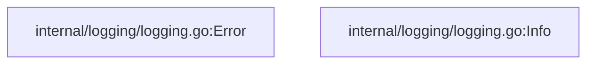

## go:main

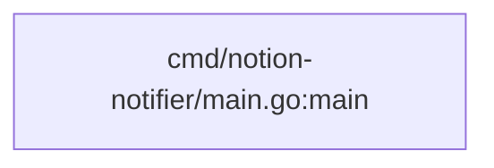

## go:middleware

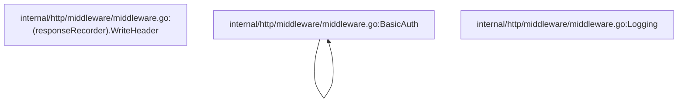

## go:notion

```mermaid
flowchart TD
  n1["internal/notion/client.go:(Client).FetchContent"]
  n2["internal/notion/client.go:(Client).QueryDatabase"]
  n3["internal/notion/client.go:(Client).QueryDatabaseOnOrAfter"]
  n4["internal/notion/client.go:(Client).doRequest"]
  n5["internal/notion/client.go:(Client).listBlocks"]
  n6["internal/notion/client.go:ExtractEmails"]
  n7["internal/notion/client.go:ExtractString"]
  n8["internal/notion/client.go:MapPagesToEvents"]
  n9["internal/notion/client.go:New"]
  n10["internal/notion/client.go:blockInfo"]
  n11["internal/notion/client.go:extractContentFromBlocks"]
  n12["internal/notion/client.go:formatBlock"]
  n13["internal/notion/client.go:formatHeading"]
  n14["internal/notion/client.go:headingMatches"]
  n15["internal/notion/client.go:joinBlockText"]
  n16["internal/notion/client.go:joinRichText"]
  n17["internal/notion/client.go:parseDateRange"]
  n18["internal/notion/client.go:splitDateTime"]
  n19["internal/notion/client_test.go:TestMapPagesToEvents_DisabledAttendees"]
  n20["internal/notion/client_test.go:TestMapPagesToEvents_MapsAttendees"]
  n21["internal/notion/client_test.go:TestQueryDatabaseOnOrAfter_SendsDateFilter"]
  n22["internal/notion/client_test.go:TestQueryDatabase_NoFilterWhenDateConfigMissing"]
  n1 --> n11
  n3 --> n9
  n7 --> n7
  n7 --> n16
  n8 --> n6
  n8 --> n7
  n8 --> n17
  n10 --> n15
  n11 --> n10
  n11 --> n12
  n11 --> n13
  n11 --> n14
  n12 --> n13
  n17 --> n18
  n19 --> n8
  n20 --> n8
  n21 --> n9
  n22 --> n9
```

## go:retry

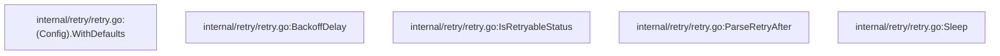

## go:scheduler

```mermaid
flowchart TD
  n1["internal/scheduler/runtime.go:(Scheduler).NotionSyncStatus"]
  n2["internal/scheduler/runtime.go:(Scheduler).cancelRuntime"]
  n3["internal/scheduler/runtime.go:(Scheduler).clearAdvanceTimers"]
  n4["internal/scheduler/runtime.go:(Scheduler).currentTimezone"]
  n5["internal/scheduler/runtime.go:(Scheduler).markPeriodicSent"]
  n6["internal/scheduler/runtime.go:(Scheduler).newRuntimeOpContext"]
  n7["internal/scheduler/runtime.go:(Scheduler).periodicSent"]
  n8["internal/scheduler/runtime.go:(Scheduler).runtimeContext"]
  n9["internal/scheduler/runtime.go:(Scheduler).setNotionStatus"]
  n10["internal/scheduler/runtime.go:(Scheduler).setRuntimeContext"]
  n11["internal/scheduler/runtime.go:(Scheduler).withRuntimeOp"]
  n12["internal/scheduler/worker.go:(Scheduler).PreviewAdvanceTemplate"]
  n13["internal/scheduler/worker.go:(Scheduler).PreviewManualTemplate"]
  n14["internal/scheduler/worker.go:(Scheduler).RebuildAdvanceSchedules"]
  n15["internal/scheduler/worker.go:(Scheduler).Reload"]
  n16["internal/scheduler/worker.go:(Scheduler).SchedulePendingFromDB"]
  n17["internal/scheduler/worker.go:(Scheduler).SendManualNotification"]
  n18["internal/scheduler/worker.go:(Scheduler).Start"]
  n19["internal/scheduler/worker.go:(Scheduler).Stop"]
  n20["internal/scheduler/worker.go:(Scheduler).SyncCalendar"]
  n21["internal/scheduler/worker.go:(Scheduler).SyncNotion"]
  n22["internal/scheduler/worker.go:(Scheduler).calendarLoop"]
  n23["internal/scheduler/worker.go:(Scheduler).deleteCalendarEvents"]
  n24["internal/scheduler/worker.go:(Scheduler).fireAdvance"]
  n25["internal/scheduler/worker.go:(Scheduler).periodicLoop"]
  n26["internal/scheduler/worker.go:(Scheduler).rebuildAdvanceSchedules"]
  n27["internal/scheduler/worker.go:(Scheduler).renderListFromRange"]
  n28["internal/scheduler/worker.go:(Scheduler).schedulePendingFromDB"]
  n29["internal/scheduler/worker.go:(Scheduler).sendPeriodic"]
  n30["internal/scheduler/worker.go:(Scheduler).sendWebhook"]
  n31["internal/scheduler/worker.go:(Scheduler).syncCalendar"]
  n32["internal/scheduler/worker.go:(Scheduler).syncLoop"]
  n33["internal/scheduler/worker.go:(Scheduler).syncNotion"]
  n34["internal/scheduler/worker.go:New"]
  n35["internal/scheduler/worker.go:buildAdvanceSchedules"]
  n36["internal/scheduler/worker.go:buildFilterValues"]
  n37["internal/scheduler/worker.go:buildTemplateEvents"]
  n38["internal/scheduler/worker.go:extractCustomValues"]
  n39["internal/scheduler/worker.go:groupCalendarEvents"]
  n40["internal/scheduler/worker.go:matchAdvanceConditions"]
  n41["internal/scheduler/worker.go:matchFilter"]
  n42["internal/scheduler/worker.go:matchesDays"]
  n43["internal/scheduler/worker.go:notionOnOrAfterDate"]
  n44["internal/scheduler/worker.go:parseEventStart"]
  n45["internal/scheduler/worker.go:pickPrimaryCalendarEvent"]
  n46["internal/scheduler/worker.go:scheduleKey"]
  n47["internal/scheduler/worker.go:toTemplateEvent"]
  n48["internal/scheduler/worker.go:weekdayToConfig"]
  n49["internal/scheduler/worker_test.go:TestMatchAdvanceConditions"]
  n50["internal/scheduler/worker_test.go:TestMatchesDays"]
  n51["internal/scheduler/worker_test.go:TestNotionOnOrAfterDate_JSTEarlyMorningUsesPreviousUTCDate"]
  n52["internal/scheduler/worker_test.go:TestNotionOnOrAfterDate_PSTUsesSameUTCDate"]
  n53["internal/scheduler/worker_test.go:TestSendWebhookRecordsHistoryOnPayloadRenderError"]
  n54["internal/scheduler/worker_test.go:TestToTemplateEvent_MapsEndDateAndTime"]
  n12 --> n38
  n12 --> n47
  n24 --> n38
  n24 --> n47
  n25 --> n42
  n25 --> n48
  n26 --> n35
  n27 --> n37
  n28 --> n46
  n30 --> n34
  n31 --> n34
  n31 --> n39
  n31 --> n45
  n33 --> n34
  n33 --> n43
  n35 --> n40
  n35 --> n44
  n36 --> n38
  n37 --> n38
  n37 --> n47
  n40 --> n36
  n40 --> n41
  n40 --> n42
  n40 --> n48
  n49 --> n40
  n49 --> n48
  n50 --> n42
  n50 --> n48
  n51 --> n43
  n52 --> n43
  n53 --> n34
  n54 --> n47
```

## go:static

```mermaid
flowchart TD
  n1["internal/http/static/spa.go:NewSPAHandler"]
```

## go:template

```mermaid
flowchart TD
  n1["internal/template/renderer.go:(Renderer).RenderList"]
  n2["internal/template/renderer.go:(Renderer).RenderPayload"]
  n3["internal/template/renderer.go:(Renderer).RenderSingle"]
  n4["internal/template/renderer.go:New"]
  n5["internal/template/renderer.go:newTemplate"]
  n1 --> n5
  n2 --> n5
  n3 --> n5
  n5 --> n4
```

## go:webhook

```mermaid
flowchart TD
  n1["internal/webhook/client.go:(Client).Send"]
  n2["internal/webhook/client.go:New"]
  n1 --> n2
```

## script:scripts/deploy-mac.sh

```mermaid
flowchart TD
  n1["scripts/deploy-mac.sh:usage"]
  n1 --> n1
```

