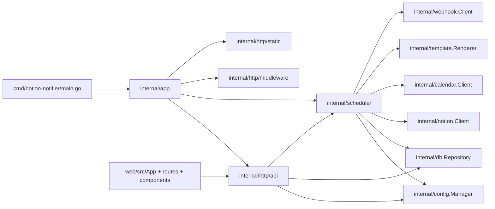

# Global Function Responsibility Map (KISS Audit)

Generated: 2026-02-17 JST

## Scope
- tree scan: `ls -R cmd internal web/src scripts docs`
- function extraction:
  - Go: `rg -n '^func ...' cmd internal` (excluding `_test.go` for production map)
  - Frontend: `rg -n 'function ...' web/src`
  - Scripts: `rg -n 'name() {' scripts/*`
- full raw inventory: `docs/function-inventory.md`

## Function Count by Responsibility Boundary

### Backend (production only)

| Boundary | Functions |
|---|---:|
| EntryPoint (`cmd/`) | 1 |
| AppBootstrap (`internal/app/`) | 6 |
| Scheduler (`internal/scheduler/`) | 47 |
| Repository (`internal/db/`) | 24 |
| HTTP API (`internal/http/api/`) | 22 |
| Config (`internal/config/`) | 21 |
| Notion (`internal/notion/`) | 18 |
| Calendar (`internal/calendar/`) | 15 |
| Retry (`internal/retry/`) | 5 |
| Template (`internal/template/`) | 5 |
| HTTP Middleware (`internal/http/middleware/`) | 3 |
| Webhook (`internal/webhook/`) | 2 |
| Logging (`internal/logging/`) | 2 |
| HTTP Static (`internal/http/static/`) | 1 |

### Frontend

| Boundary | Functions |
|---|---:|
| UI Route (`web/src/routes/`) | 26 |
| UI Frame (`web/src/App.svelte`) | 10 |
| UI Component (`web/src/components/`) | 4 |
| UI Lib (`web/src/lib/`) | 1 |

## System Responsibility Graph

## Integration and KISS Findings

### 1) Config write paths are scattered
- backend writes:
  - `internal/http/api/handler.go:67` (`PUT /api/config`)
  - `internal/http/api/handler.go:424` (manual send endpoint mutates config)
- frontend writes:
  - `web/src/App.svelte:111`
  - `web/src/routes/Calendar.svelte:27`
  - `web/src/routes/Notifications.svelte:33`
  - `web/src/routes/Settings.svelte:21`
- impact: same responsibility (save config) is duplicated across multiple UI routes and one side-effect endpoint.

### 2) Config change hook to scheduler rebuild is not unified
- `internal/http/api/handler.go:60` updates config, but does not call `sched.Reload()`.
- rebuild entrypoint exists: `internal/scheduler/worker.go:101`.
- impact: notification rule changes can remain stale until later sync/rebuild paths happen.

### 3) Manual notification endpoint mixes two responsibilities
- `internal/http/api/handler.go:404` endpoint both:
  - persists template (`h.cfg.UpdateConfig`)
  - sends webhook (`h.sched.SendManualNotification`)
- impact: save responsibility and send responsibility are coupled, which raises cognitive load and error surface.

### 4) Periodic preview semantics drift from actual periodic send
- periodic send path: `internal/scheduler/worker.go:361` uses `rule.DaysAhead`.
- periodic preview path in UI calls generic preview without date range:
  - `web/src/routes/Notifications.svelte:100`
- preview API fallback range defaults to current day:
  - `internal/http/api/timeutil.go:11`
- impact: preview result can diverge from real periodic send selection.

### 5) Scheduler worker is a god-file
- `internal/scheduler/worker.go` has 36 functions and ~873 lines.
- responsibilities mixed in one file:
  - loops/runtime entry
  - notion sync
  - calendar sync
  - advance scheduling
  - rendering/sending/history
  - filtering/template transforms
- impact: local changes have high regression risk and low readability.

### 6) UI save behavior is duplicated per page
- multiple route-local `saveConfig` functions perform identical API/update/toast flow.
- impact: repeated logic and drift risk in validation/error behavior.

## Remediation Map (keep / merge / split)

| Module | Action | Why | Expected Effect |
|---|---|---|---|
| `internal/scheduler/worker.go` | split by domain blocks (sync/calendar/notify/schedule) | reduce mixed responsibilities | lower change blast radius |
| `internal/http/api/handler.go` | merge config-change hook in one helper after successful save | single place for `UpdateConfig + Reload` policy | removes stale schedule gap |
| `internal/http/api/handler.go` | split manual send flow into explicit save step + send step (same endpoint surface possible) | remove mixed concerns | simpler error handling |
| `web/src/routes/*.svelte` | merge duplicated saveConfig logic into shared helper | eliminate copy-paste flow | smaller UI code, consistent UX |
| `web/src/routes/Notifications.svelte` + API preview | align periodic preview input with `DaysAhead` semantics | preview/send consistency | fewer operator surprises |
| `internal/scheduler/sendWebhook` | keep as single history writer | already unified for notification history | preserve single source of truth |

## Suggested Refactor Order
1. unify backend config update hook (`UpdateConfig` success -> scheduler reload policy)
2. align periodic preview semantics with send semantics
3. deduplicate frontend saveConfig flow
4. split scheduler worker file by domain while preserving function signatures
